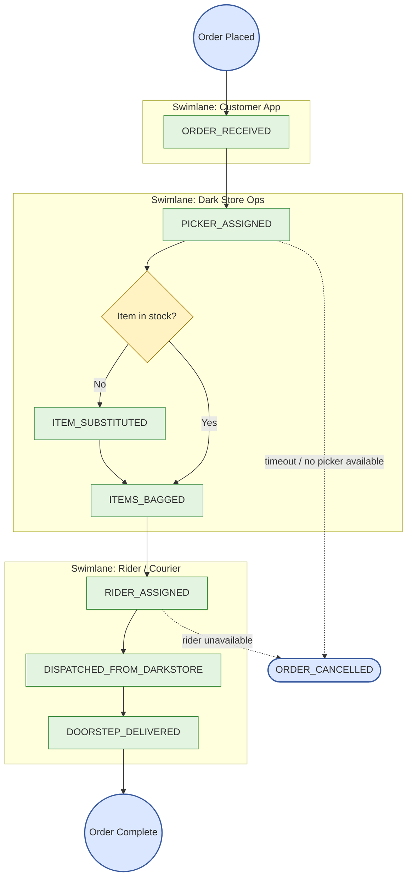

# BPM Case Study — Quick-Commerce Order Fulfillment & Dark-Store Dispatch

**22MDCE01 – Business Process Management, Cycle II Project-Based Case Study.**
Uses the same Docker stack (Kafka, Spark, MinIO, Hive Metastore) built for the Data Engineering Lab as its infrastructure, applied to a new BPM-shaped event domain — Scenario 4 (Superstore) from the assignment brief.

## Business context

A quick-commerce dark store (Blinkit/Instamart-style) has a 15-minute delivery promise. An order moves through picking, bagging, rider dispatch, and doorstep delivery; a delay or process failure at any stage — a stuck picker, a substituted item nobody logged, a rider skipped — directly breaks the SLA and costs the business a refund or a lost customer. This case study builds the pipeline that would catch those failures **as they happen**, not in a post-mortem the next day.

## Event taxonomy

Every process event follows this schema (matches the assignment's required `case_id` / `activity` / `timestamp` taxonomy):

```json
{
  "case_id": "ORD-SUPER-000047",
  "activity": "ITEMS_BAGGED",
  "timestamp": "2026-09-28T11:03:40Z",
  "resource": "Picker_Emp_112",
  "location": "DarkStore_Coimbatore_North",
  "metadata": {
    "item_count": 8,
    "target_total_minutes": 15,
    "picking_sla_minutes": 3
  }
}
```

`ITEM_SUBSTITUTED` events carry two extra metadata fields (`substituted_item`, `reason`) and are logged as exception events — they don't advance the main process sequence.

## BPMN process map



Three swimlanes (Customer App / Dark Store Ops / Rider), one exception gateway (out-of-stock substitution), and two courier-handoff points (picker→rider at `ITEMS_BAGGED`→`RIDER_ASSIGNED`, rider→doorstep at `DISPATCHED_FROM_DARKSTORE`→`DOORSTEP_DELIVERED`), plus the cancellation escape path the assignment specifically asks for.

## KPIs

| KPI | Definition | Where it's computed |
|---|---|---|
| **Cycle time** | Minutes between consecutive stage events for a case (`stage_minutes`); total time `ORDER_RECEIVED`→`DOORSTEP_DELIVERED` (`total_minutes`) | `bpm_process_engine.py`, per event |
| **SLA limits** | Per-stage targets (1 / 3 / 2 / 2 / 7 min, summing to the 15-min `target_total_minutes` promise) — picking stage is data-driven from `metadata.picking_sla_minutes`, others are fixed ops constants | `STAGE_SLA_MINUTES` in `bpm_process_engine.py` |
| **Bottleneck stage** | The stage-to-stage transition with the highest average `stage_minutes` or highest SLA-breach rate | Printed every batch; queryable via `bpm.process_events` |
| **Throughput** | Count of `DOORSTEP_DELIVERED` events per micro-batch / time window | Printed every batch as part of the KPI line |
| **Drop-off rate** | % of cases whose latest known state (`bpm.case_state`) never reached `DOORSTEP_DELIVERED` | Query against `case_state` (see Trino section) |

## Anomaly & SLA detection (the 15-mark PySpark component)

`bpm_process_engine.py` reconstructs each case's process state per micro-batch — using an in-batch window function first (since a fast-moving case can have several events land in the same 10-second trigger), falling back to a persisted `case_state` Delta table for state carried across batches — and flags:

| Anomaly | How it's detected |
|---|---|
| **SLA breach** | `stage_minutes > sla_limit_minutes` for that transition, or (at delivery) `total_minutes > metadata.target_total_minutes` |
| **Duplicate task** | Incoming `activity` equals the case's previous activity |
| **Out-of-sequence activity** | Incoming stage index is ≤ the case's previous stage index (went backward or repeated out of place), or the case's very first observed event isn't `ORDER_RECEIVED` |
| **Process deviation** | Surfaces as a combination of the above — e.g. `DOORSTEP_DELIVERED` with no prior `DISPATCHED_FROM_DARKSTORE` shows up as an out-of-sequence flag on the delivery event |

Every event — anomalous or not — is written to `bpm.process_events` as an immutable audit log with these flags attached, so nothing is silently dropped (mirrors the dead-letter philosophy from the Week 1/2 respiratory pipeline, just applied to process conformance instead of schema validity).

## Run steps

Same Docker stack as the main project — no new services needed for the producer/engine (Trino is separate, see below).

```powershell
# 1. Stack already running from the main project (docker compose up -d)

# 2. Simulate orders (host terminal)
python bpm/bpm_producer.py --cases 40

# 3. Run the process engine (separate terminal)
docker compose exec spark spark-submit `
  --packages org.apache.spark:spark-sql-kafka-0-10_2.12:3.5.6,io.delta:delta-spark_2.12:3.3.3,org.apache.hadoop:hadoop-aws:3.3.4 `
  bpm/bpm_process_engine.py
```

Watch the console for the per-batch table (case_id / activity / prev_activity / stage_minutes / sla_breached / is_duplicate / is_out_of_sequence), the bottleneck-candidate stage durations, and the running KPI totals.

Query directly with `spark-sql` today (same flags as the main project's Week 2 query, `--database bpm`):

```sql
SELECT prev_activity, activity, round(avg(stage_minutes),2) AS avg_minutes, count(*) AS n
FROM bpm.process_events
WHERE stage_minutes IS NOT NULL
GROUP BY prev_activity, activity
ORDER BY avg_minutes DESC;
```

## Querying via Trino (the 15-mark component — pending Week 3 infra)

Trino isn't in `docker-compose.yml` yet (that's Week 3 of the main DE Lab project). Once it's added with a catalog pointing at this same Hive Metastore, these are the queries to run for that rubric section — written now against the schema above so they're ready to go:

```sql
-- Return/Order Turnaround Time (TAT) per dark store
SELECT location,
       round(avg(total_minutes), 2) AS avg_tat_minutes,
       round(approx_percentile(total_minutes, 0.95), 2) AS p95_tat_minutes
FROM bpm.process_events
WHERE activity = 'DOORSTEP_DELIVERED'
GROUP BY location
ORDER BY avg_tat_minutes DESC;

-- Stage-by-stage bottleneck heatmap
SELECT prev_activity, activity,
       round(avg(stage_minutes), 2) AS avg_minutes,
       round(100.0 * sum(CASE WHEN sla_breached THEN 1 ELSE 0 END) / count(*), 1) AS sla_breach_pct
FROM bpm.process_events
WHERE stage_minutes IS NOT NULL
GROUP BY prev_activity, activity
ORDER BY sla_breach_pct DESC;

-- Drop-off rate: cases stuck / never delivered
SELECT last_activity, count(*) AS stuck_cases
FROM bpm.case_state
WHERE last_activity <> 'DOORSTEP_DELIVERED'
GROUP BY last_activity
ORDER BY stuck_cases DESC;

-- Active bottleneck: cases currently mid-process, grouped by their current stage
SELECT last_activity AS current_stage, count(*) AS cases_in_stage
FROM bpm.case_state
GROUP BY last_activity
ORDER BY cases_in_stage DESC;
```

## Rubric mapping (40 marks)

| Component | Marks | Where to point the grader |
|---|---|---|
| BPMN diagram, process stages, KPIs, event taxonomy | 10 | This README — BPMN map, KPI table, event taxonomy section |
| PySpark SLA & anomaly detection | 15 | `bpm_process_engine.py` + a live run showing the console anomaly output |
| Querying the lakehouse for process metrics | 15 | `spark-sql` queries today (works now); Trino queries above (once Week 3 lands) |
